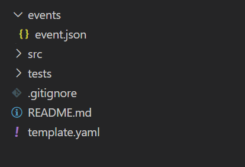

## AWS SAM(Serverless Application Model) ?

### Required installation

1. Python 설치

2. aws-sam-cli 설치

```bash
 //--user 옵션을 추가하면  root 권한이 없어도 패키지 설치가 가능.
 pip install --user aws-sam-cli
```

3. Docker 설치  
    OS Window일 경우 WSL2가 설치되어야함.
    (https://www.44bits.io/ko/post/wsl2-install-and-basic-usage)

4. AWS CLI 설치 (아래 링크 참고)
 https://docs.aws.amazon.com/ko_kr/cli/latest/userguide/getting-started-install.html
 
### SAM 구축 명령어

```
sam init --runtime <your python version> --name <project name>
ex) sam init --runtime python3.8 --name sangwon-sam-app
```

### SAM 핵심 파일



-   event.json : 람다 함수 파라미터로 넘길 인자값이 존재.
-   template.yaml : 람다의 환경을 설정할 수 있는 파일. ( 람다 실행시간, 람다 환경변수,Layer 등)

### SAM Build

```
sam build --template <your_yaml_file_name> --use-container
```

### SAM Run

```
# 이벤트 사용
sam local invoke <your_function_name> --event <your_event_path>
# 이벤트 사용없이
sam local invoke <your_function_name> --no-event
```

### SAM Deploy

```
aws lambda update-function-code --function-name <your_function_name> --zip-file fileb://function.zip --profile <your_profile_name>
```

### 참고 문헌

-   https://docs.aws.amazon.com/ko_kr/serverless-application-model/latest/developerguide/what-is-sam.html

-   https://docs.aws.amazon.com/ko_kr/serverless-application-model/latest/developerguide/sam-specification-template-anatomy.html
